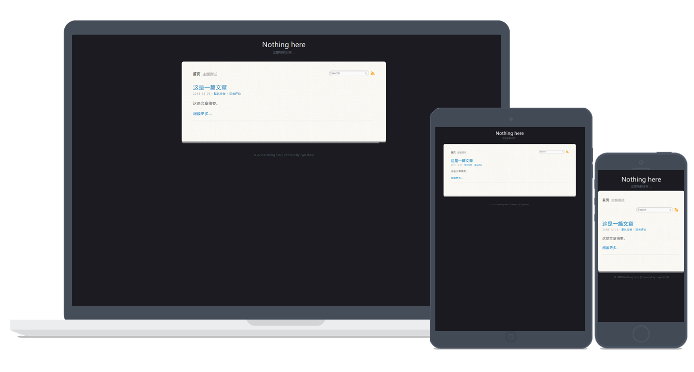

# SimpleProwerV5
ProwerV5 For Typecho

勉强能用但已经弃坑。

------------

看到了Prower大大的WordPress主题[ProwerV5](http://www.prower.cn/work/2200 "ProwerV5")十分简洁，也十分喜欢，就想把这个主题搞成Typecho的主题。

也算是圆了多年的梦了。至少证明我梦想还没丢。

------------

特别感谢 @noisky 修复了评论框样式，细调节移动端适配，以及各种Bug修复。
我会认真向大佬学习的。

~~主题正在研究和制作中，现在存在有问题，未来还是要适配移动端。~~

希望能通过学习这个能更加喜欢上编程吧。

------------

再次感谢我们学校大佬 @noisky 的大佬主题参考和他对我热情的帮助。
